<!--

-->
<!--

-->

<!--
can use hide=glsl,js
-->

##  👋Who am i

- 一般路过
- 擅长 ctrl+c 和 ctrl+v
- 啥也不会别想了，没有擅长语言
- Learning how to program worse
- A Student
- 可以来看看我的小垃圾 [blog](https://huige233.com)

## 📫Contact me

-   Ask me in [Issue](https://github.com/huige233/huige233/issues)
-   My [GitHub](https://github.com/huige233)
-   My [Profile](https://profile.codersrank.io/user/huige233/)
-   E-mail: [huige1463@gmail.com](mailto:huige1463@gmail.com)
-    

<picture>
  <source media="(prefers-color-scheme: dark)" srcset="github-snake-dark.svg">
  <source media="(prefers-color-scheme: light)" srcset="github-snake.svg">
  
</picture>

